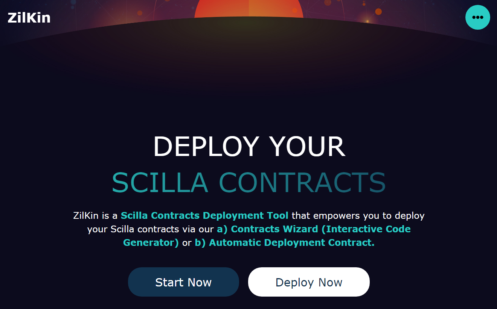

<h2 align="center"><b>ZilKin</b></h2>

<h4 align="center"><b>Scilla Contracts Deployment Tool with (a) Contracts Wizard, and (b) Automatic Deployment</b></h4>

    <a href="https://zilkin.tjh.sg">View Demo</a>
    ·
    <a href="https://github.com/xJQx/zilkin/issues/new/choose">Report Bug</a>
    ·
    <a href="https://github.com/xJQx/zilkin/issues/new/choose">Request Feature</a>

## 👋🏻 Introducing `ZilKin`

    

Looking to deploy your Scilla contracts with ease and speed? Look no further than `ZilKin`! Our **Scilla Contracts Deployment Tool** is here to make your life easier and your workflow more efficient.

With our state-of-the-art **Contracts Wizard (Interactive Code Generator)**, you can effortlessly create and deploy your contracts, saving you time and effort. Or, if you prefer a more automated approach, our **Automatic Deployment Contract** allows you to deploy your contracts with just a few clicks.

Don't waste any more time struggling with complicated deployment processes. With `ZilKin`, you'll have everything you need to get your contracts up and running in no time. Try `ZilKin` today and see how our cutting-edge tool can revolutionize the way you deploy your Scilla contracts. Take control of your workflow and experience the power of `ZilKin`!

 

## 🚀 Demo

Here is a quick demo of the app. We hope you enjoy it.

> [The Demo Link](https://zilkin.tjh.sg)

Liked it? Please give a ⭐️ to **ZilKin**.

 

## 🔥 Features

`ZilKin` comes with 2 key features:

- 🧙🏻‍♂️ Contracts Wizard
- 📃 Automatic Deployment Contract

 

## 🏗️ Tech Stack

 

## 💡 Contributing
Have an idea or improvement to make? Create an issue and make a pull request!
